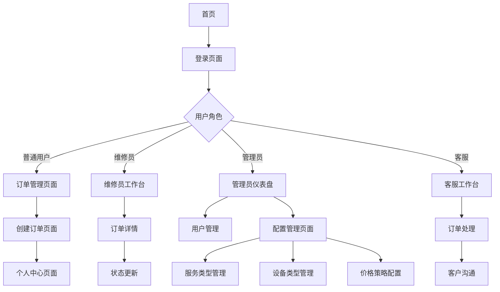

## 1. 产品概述

Fix-Platform是一个专为XGX店内部设计的维修服务管理平台，旨在解决用户下单困难、维修员工作流程不清晰、缺乏用户反馈机制等问题。
- 核心目标：建立统一的维修服务管理平台，提升服务效率和用户体验
- 目标用户：普通用户、维修员、客服人员、管理员
- 市场价值：提升店内维修服务的数字化管理水平，增强客户满意度

## 2. 核心功能

### 2.1 用户角色

| 角色 | 注册方式 | 核心权限 |
|------|----------|----------|
| 普通用户 | 手机号验证码注册 | 创建订单、查看订单状态、评价服务、管理个人信息 |
| 维修员 | 管理员分配账号 | 查看分配订单、更新维修进度、上传维修图片、处理订单状态 |
| 客服 | 管理员分配账号 | 处理用户咨询、分配订单、跟踪订单进度、处理投诉 |
| 管理员 | 系统预设账号 | 用户管理、订单分配、数据统计、系统配置、价格管理 |

### 2.2 功能模块

维修服务管理平台包含以下主要页面：

1. **首页**：平台介绍、快速操作入口、服务展示
2. **登录页面**：手机号验证码登录、用户注册
3. **订单管理页面**：订单列表、状态筛选、订单详情
4. **创建订单页面**：设备信息填写、问题描述、图片上传、预约时间选择
5. **个人中心页面**：用户信息管理、订单历史、评价记录
6. **管理员仪表盘**：数据统计、用户管理、订单分配、系统配置
7. **维修员工作台**：分配订单查看、维修进度更新、状态处理
8. **客服工作台**：订单处理、客户沟通、问题跟踪
9. **配置管理页面**：服务类型管理、设备类型管理、价格策略配置、系统参数设置

### 2.3 页面详情

| 页面名称 | 模块名称 | 功能描述 |
|----------|----------|----------|
| 首页 | 导航栏 | 显示平台Logo、用户登录状态、主要功能入口 |
| 首页 | 快速操作区 | 提供立即下单、查看订单、我要评价三个主要操作按钮 |
| 首页 | 服务介绍 | 展示平台服务类型、维修流程、联系方式 |
| 登录页面 | 手机验证 | 输入手机号、发送验证码、验证码登录注册 |
| 登录页面 | 权限控制 | 根据用户角色跳转到对应工作台页面 |
| 订单管理页面 | 订单统计 | 显示待处理、进行中、已完成订单数量统计 |
| 订单管理页面 | 订单列表 | 展示订单信息、状态标签、操作按钮（查看详情、取消订单） |
| 订单管理页面 | 搜索筛选 | 按订单状态、时间范围、设备类型筛选订单 |
| 创建订单页面 | 设备信息 | 选择设备类型、输入设备型号、选择服务类型 |
| 创建订单页面 | 问题描述 | 输入故障描述、选择紧急程度、上传故障图片 |
| 创建订单页面 | 联系信息 | 填写联系人姓名、电话、预约时间 |
| 个人中心页面 | 用户信息 | 显示和编辑用户基本信息、联系方式 |
| 个人中心页面 | 订单历史 | 查看历史订单、订单状态、评价记录 |
| 管理员仪表盘 | 数据统计 | 显示订单数量、用户统计、收入统计图表 |
| 管理员仪表盘 | 用户管理 | 查看用户列表、编辑用户信息、角色分配 |
| 管理员仪表盘 | 订单分配 | 将订单分配给维修员、跟踪订单进度 |
| 维修员工作台 | 分配订单 | 查看分配给自己的订单列表、订单详情 |
| 维修员工作台 | 进度更新 | 更新维修状态、上传维修过程图片、填写维修记录 |
| 客服工作台 | 订单处理 | 处理用户订单、协调维修安排、状态跟踪 |
| 客服工作台 | 客户沟通 | 处理用户咨询、投诉处理、问题解答 |
| 配置管理页面 | 服务类型管理 | 创建、编辑、删除服务类型，设置服务价格和预计耗时 |
| 配置管理页面 | 设备类型管理 | 管理设备类型、品牌信息、常见问题和解决方案 |
| 配置管理页面 | 价格策略 | 配置基础价格、紧急加价、折扣策略 |
| 配置管理页面 | 系统参数 | 设置系统通知、业务规则、UI主题等参数 |

## 3. 核心流程

**普通用户流程**
用户通过手机号验证码登录系统，在首页点击"立即下单"进入订单创建页面，填写设备信息、问题描述并上传故障图片，选择预约时间后提交订单。提交成功后可在订单管理页面查看订单状态，维修完成后可对服务进行评价。

**维修员流程**
维修员登录后进入工作台，查看管理员分配的订单列表，选择订单查看详细信息，到达现场后更新订单状态为"进行中"，维修过程中可上传进度图片，完成维修后更新状态为"已完成"并填写维修记录。

**管理员流程**
管理员登录后进入仪表盘查看整体数据统计，在用户管理模块管理用户信息和角色分配，在订单管理中将新订单分配给合适的维修员，通过配置管理页面设置服务类型、设备类型、价格策略等系统参数。

## 4. 用户界面设计

### 4.1 设计风格

- **主色调**：#1890ff（Ant Design蓝色）、#52c41a（成功绿色）、#faad14（警告黄色）、#ff4d4f（错误红色）
- **按钮样式**：圆角按钮，支持主要、次要、危险等多种类型，具有悬停和点击反馈效果
- **字体**：系统默认字体栈，主要文字14px，标题16-24px，小字12px
- **布局风格**：卡片式布局，顶部导航栏，左侧菜单（管理后台），响应式网格系统
- **图标风格**：使用Ant Design图标库，线性风格，统一的视觉语言

### 4.2 页面设计概览

| 页面名称 | 模块名称 | UI元素 |
|----------|----------|--------|
| 首页 | 导航栏 | 白色背景，蓝色Logo，右侧登录状态显示 |
| 首页 | 快速操作区 | 三个大按钮，蓝色主按钮，卡片阴影效果 |
| 登录页面 | 登录表单 | 居中卡片布局，输入框圆角设计，蓝色提交按钮 |
| 订单管理页面 | 统计卡片 | 四个统计卡片，不同颜色标识不同状态 |
| 订单管理页面 | 订单表格 | 斑马纹表格，状态标签彩色显示，操作按钮组 |
| 创建订单页面 | 表单区域 | 分步骤表单，输入框验证提示，图片上传预览 |
| 管理员仪表盘 | 数据统计 | 图表展示，卡片布局，响应式网格 |
| 管理员仪表盘 | 侧边菜单 | 深色背景，白色文字，选中状态高亮 |
| 配置管理页面 | 标签页 | 顶部标签切换，表格和表单结合布局 |
| 配置管理页面 | 模态框 | 弹窗表单，表单验证，确认取消按钮 |

### 4.3 响应式设计

平台采用桌面优先的响应式设计策略，基于Ant Design的栅格系统实现多设备适配：
- **桌面端（≥1200px）**：完整功能展示，侧边栏导航，多列布局
- **平板端（768px-1199px）**：自适应布局，部分功能合并显示
- **移动端（<768px）**：单列布局，触屏优化，简化操作流程
- **交互优化**：支持触屏操作，按钮大小适配手指点击，表格横向滚动

## 5. 项目配置与部署

### 5.1 项目配置

- **版本控制**：使用优化的 .gitignore 配置，确保重要文档被正确跟踪，同时保护敏感信息
- **部署配置**：使用 .vercelignore 配置，优化部署时的文件排除规则
- **环境管理**：支持开发、测试、生产多环境配置
- **文档管理**：项目文档统一存放在 .trae/documents 目录下

### 5.2 部署方案

- **前端部署**：支持 Vercel 自动化部署
- **后端部署**：支持 Docker 容器化部署
- **数据库**：MongoDB 云服务或本地部署
- **文件存储**：本地存储或云存储服务

### 5.3 项目文档

项目包含完整的技术文档：
- 产品需求文档：详细的功能需求和用户界面设计
- 技术架构文档：系统架构、API 定义和数据模型
- 项目现状分析：开发进度和优化建议
- README 文档：项目介绍和使用指南