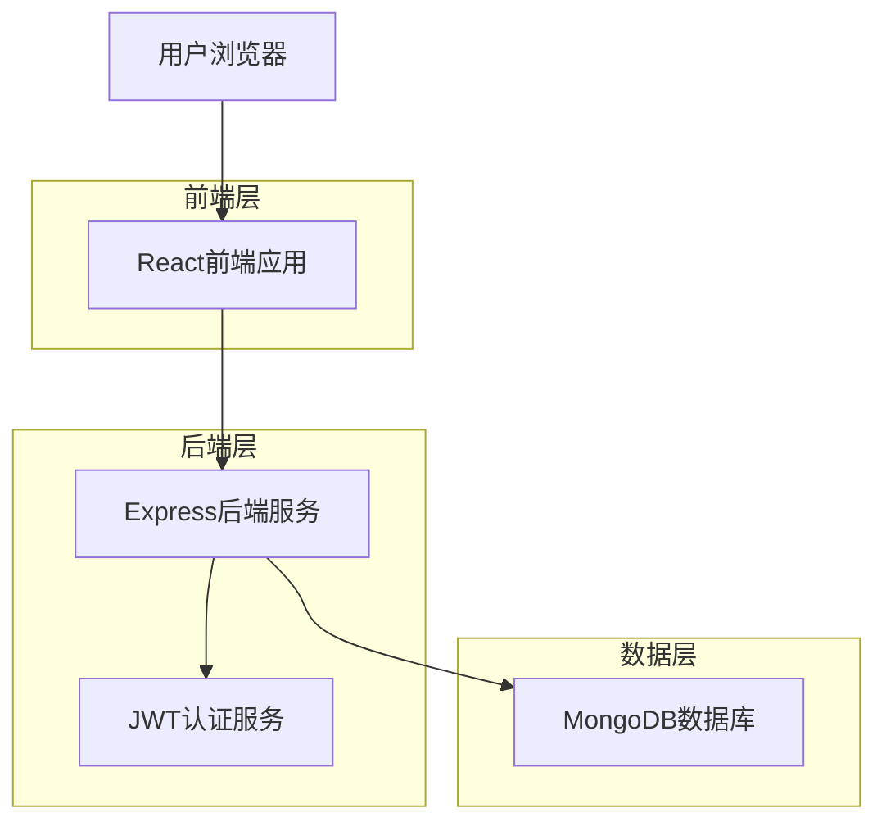
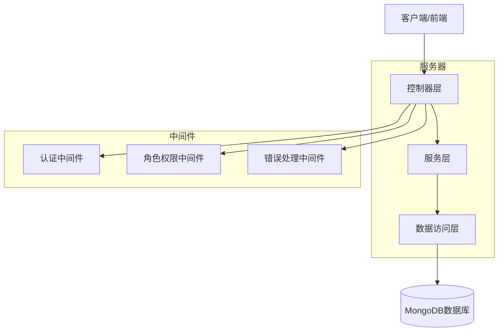
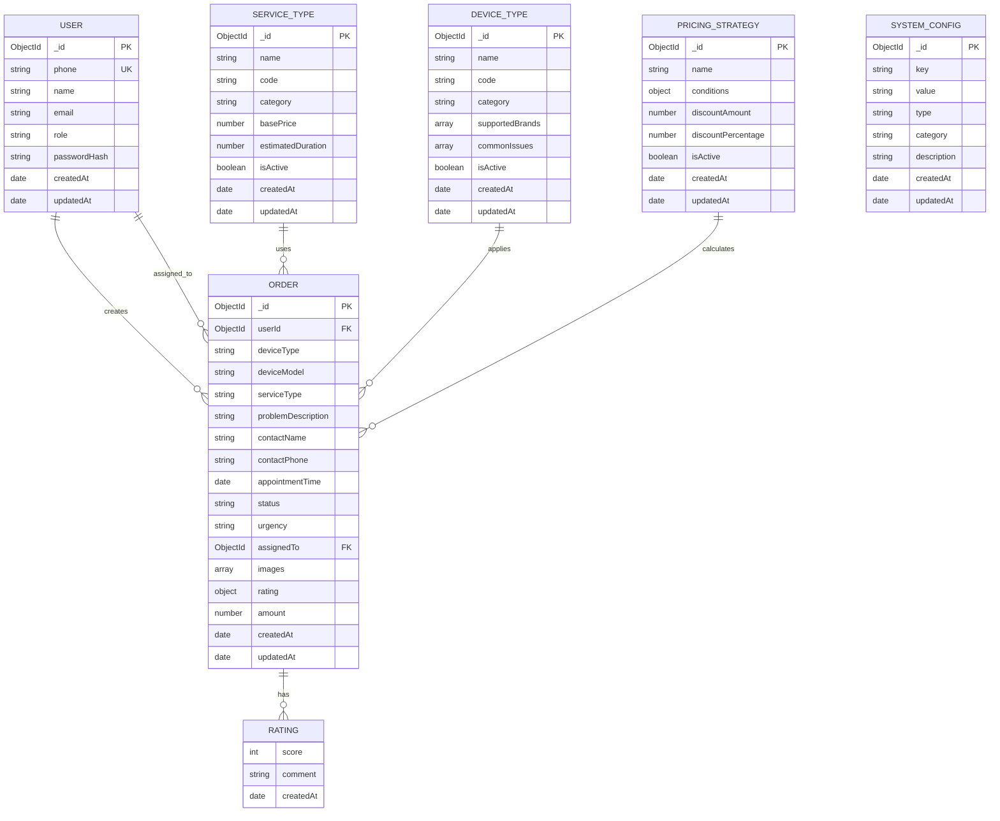

## 1. 架构设计

```

## 7. 项目配置管理

### 7.1 版本控制配置

**.gitignore 配置优化**

项目使用优化的 .gitignore 配置，确保重要文档被正确跟踪：
- 保留 .trae/documents/ 下的项目文档
- 忽略 .trae/TODO.md 临时文件
- 排除敏感信息如环境变量和密钥
- 忽略构建输出和依赖目录

### 7.2 部署配置

**.vercelignore 配置**

优化的部署配置确保只部署必要文件：
- 排除开发工具和IDE配置
- 忽略版本控制文件
- 排除日志和临时文件
- 保留项目文档用于部署后查看

### 7.3 环境管理

支持多环境配置：
- **开发环境**：本地MongoDB，详细日志
- **测试环境**：云数据库，测试数据
- **生产环境**：生产数据库，优化配置

## 8. 部署架构

### 8.1 容器化部署

使用 Docker Compose 进行多服务编排：
- MongoDB 数据库服务
- Node.js 后端服务
- React 前端服务
- 数据卷持久化

### 8.2 云平台部署

支持 Vercel 自动化部署：
- 前端静态资源部署
- API 路由配置
- 环境变量管理
- 自动构建和发布

## 9. 文档管理

### 9.1 项目文档结构

```
.trae/documents/
├── Fix-Platform产品需求文档.md
├── Fix-Platform技术架构文档.md
└── Fix-Platform项目现状分析与开发计划.md
```

### 9.2 文档维护

- **版本控制**：所有文档纳入Git管理
- **实时更新**：随项目进展同步更新
- **格式统一**：使用Markdown格式
- **内容完整**：涵盖需求、架构、进度等



## 2. 技术描述

* 前端：React@18 + Ant Design@5.26.6 + React Router@5.3.4 + Axios + 图片上传组件

* 后端：Node.js + Express@4 + JWT认证 + bcryptjs密码加密 + Multer文件上传

* 数据库：MongoDB + Mongoose ODM + 数据模型设计

* 支付系统：集成支付接口 + 订单金额计算 + 支付状态跟踪

* 配置管理：服务类型管理 + 设备类型管理 + 价格策略配置 + 系统参数设置

* 部署：Docker + Docker Compose + Vercel自动化部署

* 项目配置：优化的.gitignore和.vercelignore配置，文档管理系统

## 3. 路由定义

| 路由                | 用途                 |
| ----------------- | ------------------ |
| /                 | 首页，显示平台介绍和快速操作入口   |
| /login            | 登录页面，支持手机号验证码登录    |
| /orders           | 订单管理页面，显示用户订单列表和操作 |
| /create-order     | 创建订单页面，用户提交维修申请    |
| /profile          | 个人中心页面，用户信息管理      |
| /admin            | 管理员仪表盘（根据角色动态渲染）   |
| /repairman        | 维修员工作台（根据角色动态渲染）   |
| /customer-service | 客服工作台（根据角色动态渲染）    |

## 4. API定义

### 4.1 核心API

**用户认证相关**

```
POST /api/auth/send-code
```

请求参数：

| 参数名   | 参数类型   | 是否必需 | 描述    |
| ----- | ------ | ---- | ----- |
| phone | string | true | 用户手机号 |

响应参数：

| 参数名     | 参数类型    | 描述     |
| ------- | ------- | ------ |
| success | boolean | 操作是否成功 |
| message | string  | 响应消息   |

```
POST /api/auth/login
```

请求参数：

| 参数名   | 参数类型   | 是否必需 | 描述    |
| ----- | ------ | ---- | ----- |
| phone | string | true | 用户手机号 |
| code  | string | true | 验证码   |

响应参数：

| 参数名     | 参数类型    | 描述      |
| ------- | ------- | ------- |
| success | boolean | 登录是否成功  |
| token   | string  | JWT认证令牌 |
| user    | object  | 用户信息对象  |

**订单管理相关**

```
POST /api/orders
```

请求参数：

| 参数名                | 参数类型   | 是否必需  | 描述                       |
| ------------------ | ------ | ----- | ------------------------ |
| deviceType         | string | true  | 设备类型                     |
| deviceModel        | string | true  | 设备型号                     |
| serviceType        | string | true  | 服务类型（repair/appointment） |
| problemDescription | string | true  | 问题描述                     |
| contactName        | string | true  | 联系人姓名                    |
| contactPhone       | string | true  | 联系电话                     |
| appointmentTime    | string | true  | 预约时间                     |
| urgency            | string | false | 紧急程度                     |
| images             | array  | false | 图片数组                     |

```
GET /api/orders
```

响应参数：

| 参数名     | 参数类型    | 描述     |
| ------- | ------- | ------ |
| success | boolean | 请求是否成功 |
| orders  | array   | 订单列表   |

**用户管理相关**

```
GET /api/users/admin/all
```

响应参数：

| 参数名     | 参数类型    | 描述     |
| ------- | ------- | ------ |
| success | boolean | 请求是否成功 |
| users   | array   | 用户列表   |

**配置管理相关**

```
GET /api/config/service-types
POST /api/config/service-types
PUT /api/config/service-types/:id
DELETE /api/config/service-types/:id
```

服务类型管理API，支持CRUD操作

```
GET /api/config/device-types
POST /api/config/device-types
PUT /api/config/device-types/:id
DELETE /api/config/device-types/:id
```

设备类型管理API，支持CRUD操作

**支付系统相关**

```
GET /api/payment/prices
```

获取服务价格列表

```
POST /api/payment/initiate
```

发起支付请求

请求参数：

| 参数名 | 参数类型 | 是否必需 | 描述 |
|--------|----------|----------|------|
| orderId | string | true | 订单ID |
| paymentMethod | string | true | 支付方式 |

```
GET /api/payment/status/:orderId
```

查询支付状态

示例请求：

```json
{
  "deviceType": "笔记本电脑",
  "deviceModel": "ThinkPad X1",
  "serviceType": "repair",
  "problemDescription": "开机黑屏，风扇转动但无显示",
  "contactName": "张三",
  "contactPhone": "13800138000",
  "appointmentTime": "2025-01-10T10:00:00.000Z",
  "urgency": "high"
}
```

## 5. 服务器架构图



## 6. 数据模型

### 6.1 数据模型定义



### 6.2 数据定义语言

**用户表 (users)**

```javascript
// 创建用户模型
const userSchema = new mongoose.Schema({
  phone: {
    type: String,
    required: true,
    unique: true,
    match: /^1[3-9]\d{9}$/
  },
  name: {
    type: String,
    default: ''
  },
  email: {
    type: String,
    default: ''
  },
  role: {
    type: String,
    enum: ['user', 'repairman', 'customer_service', 'admin'],
    default: 'user'
  },
  passwordHash: {
    type: String,
    default: ''
  }
}, {
  timestamps: true
});

// 创建索引
userSchema.index({ phone: 1 });
userSchema.index({ role: 1 });
```

**订单表 (orders)**

```javascript
// 创建订单模型
const orderSchema = new mongoose.Schema({
  userId: {
    type: mongoose.Schema.Types.ObjectId,
    ref: 'User'
  },
  deviceType: {
    type: String,
    required: true
  },
  deviceModel: {
    type: String,
    required: true
  },
  serviceType: {
    type: String,
    enum: ['repair', 'appointment'],
    required: true
  },
  problemDescription: {
    type: String,
    required: true
  },
  contactName: {
    type: String,
    required: true
  },
  contactPhone: {
    type: String,
    required: true
  },
  appointmentTime: {
    type: Date,
    required: true
  },
  status: {
    type: String,
    enum: ['pending', 'confirmed', 'in_progress', 'completed', 'cancelled'],
    default: 'pending'
  },
  urgency: {
    type: String,
    enum: ['low', 'medium', 'high'],
    default: 'medium'
  },
  assignedTo: {
    type: mongoose.Schema.Types.ObjectId,
    ref: 'User'
  },
  images: [{
    type: String
  }],
  rating: {
    score: {
      type: Number,
      min: 1,
      max: 5
    },
    comment: String,
    createdAt: {
      type: Date,
      default: Date.now
    }
  },
  repairNotes: String
}, {
  timestamps: true
});

// 创建索引
orderSchema.index({ userId: 1, createdAt: -1 });
orderSchema.index({ assignedTo: 1, status: 1 });
orderSchema.index({ status: 1, createdAt: -1 });
```

**初始化数据**

```javascript
// 初始化管理员用户
const adminUser = {
  phone: '13800000001',
  name: '管理员',
  role: 'admin',
  passwordHash: await bcrypt.hash('123456', 10)
};

// 初始化测试订单
const testOrder = {
  deviceType: '笔记本电脑',
  deviceModel: 'ThinkPad X1',
  serviceType: 'repair',
  problemDescription: '开机黑屏问题',
  contactName: '测试用户',
  contactPhone: '13800138000',
  appointmentTime: new Date(),
  status: 'pending',
  urgency: 'medium'
};
```

