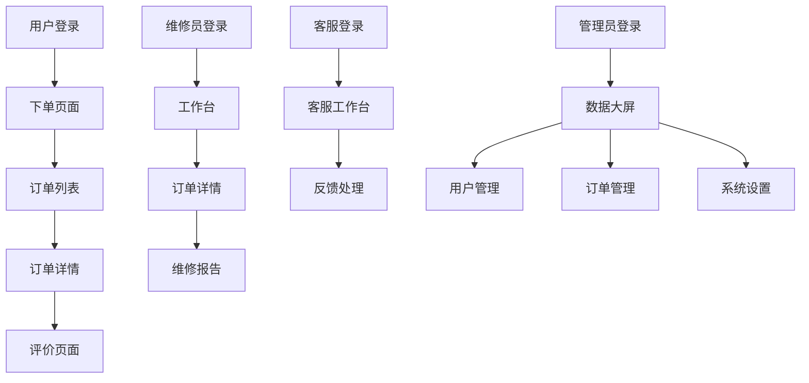

# XGX店内部维修下单管理系统 - 产品需求文档

## 1. 产品概述

XGX店内部维修下单管理系统是一个综合性的维修服务管理平台，旨在解决用户下单困难、维修流程不透明、数据统计困难等问题。系统支持用户在线下单、维修员接单处理、客服跟进服务、管理员统一管理的完整业务流程。

- 解决用户下单困难和缺乏反馈的问题
- 为维修人员提供直观的工单管理界面
- 建立统一的数据大屏和报表系统
- 收集用户评价反馈，提升服务质量
- 提供统一的收款平台

## 2. 核心功能

### 2.1 用户角色

| 角色 | 注册方式 | 核心权限 |
|------|----------|----------|
| 普通用户 | 手机验证码注册 | 下单、查看订单状态、评价服务 |
| 维修员 | 管理员分配账号 | 接单、更新维修进度、上传维修图片 |
| 客服人员 | 管理员分配账号 | 处理用户反馈、订单跟进、客户沟通 |
| 管理员 | 系统预设账号 | 用户管理、数据统计、系统配置 |

### 2.2 功能模块

系统包含以下主要页面：
1. **用户端页面**：登录注册、下单页面、订单列表、订单详情、个人中心
2. **维修员端页面**：工作台、待处理订单、订单详情、个人信息
3. **客服端页面**：客服工作台、用户反馈处理、订单跟进
4. **管理员端页面**：数据大屏、用户管理、订单管理、系统设置

### 2.3 页面详情

| 页面名称 | 模块名称 | 功能描述 |
|----------|----------|----------|
| 用户登录注册页 | 身份验证模块 | 手机验证码登录注册、用户信息完善 |
| 用户下单页面 | 订单创建模块 | 选择维修类型、填写设备信息、上传图片、选择服务时间 |
| 用户订单列表 | 订单管理模块 | 查看所有订单、筛选订单状态、快速操作 |
| 用户订单详情 | 订单跟踪模块 | 查看订单进度、维修图片、费用明细、在线评价 |
| 用户个人中心 | 用户信息模块 | 个人信息管理、地址管理、评价历史 |
| 维修员工作台 | 工单管理模块 | 待处理订单列表、今日工作统计、快速接单 |
| 维修员订单详情 | 维修处理模块 | 更新维修进度、上传维修图片、填写维修报告、费用录入 |
| 客服工作台 | 客服管理模块 | 用户反馈处理、订单异常跟进、客户沟通记录 |
| 管理员数据大屏 | 数据统计模块 | 订单统计图表、收入分析、用户满意度、维修员绩效 |
| 管理员用户管理 | 用户管理模块 | 用户信息查看、维修员账号管理、权限分配 |
| 管理员订单管理 | 订单监控模块 | 所有订单查看、异常订单处理、订单数据导出 |
| 管理员系统设置 | 系统配置模块 | 维修类型配置、价格设置、系统参数配置 |

## 3. 核心流程

**用户流程：**
用户通过手机验证码注册登录 → 在下单页面选择维修类型和填写设备信息 → 提交订单等待维修员接单 → 查看订单进度和维修详情 → 维修完成后进行评价和付款

**维修员流程：**
维修员登录工作台 → 查看待处理订单列表 → 接单并联系用户 → 到达现场进行维修 → 实时更新维修进度和上传图片 → 完成维修并提交报告

**客服流程：**
客服登录工作台 → 处理用户反馈和投诉 → 跟进异常订单 → 协调用户和维修员沟通 → 记录处理结果

**管理员流程：**
管理员登录系统 → 查看数据大屏了解整体运营情况 → 管理用户和维修员账号 → 处理系统配置和价格设置 → 导出数据报表

## 4. 用户界面设计

### 4.1 设计风格

- **主色调**：蓝色系（#1890FF）作为主色，灰色系（#F5F5F5）作为背景色
- **按钮样式**：圆角按钮设计，主要按钮采用渐变效果
- **字体**：中文使用微软雅黑，英文使用Roboto，主要字号14px-16px
- **布局风格**：卡片式布局，顶部导航栏设计
- **图标风格**：使用Ant Design图标库，简洁现代风格

### 4.2 页面设计概览

| 页面名称 | 模块名称 | UI元素 |
|----------|----------|--------|
| 用户下单页面 | 订单创建模块 | 卡片式表单布局，蓝色主题色，大按钮设计，图片上传区域采用虚线边框 |
| 维修员工作台 | 工单管理模块 | 列表卡片布局，状态标签采用不同颜色区分，快速操作按钮 |
| 管理员数据大屏 | 数据统计模块 | 深色主题，图表采用蓝色渐变，大屏幕适配，实时数据更新动画 |
| 用户订单详情 | 订单跟踪模块 | 时间轴设计展示进度，图片预览功能，评分星级组件 |

### 4.3 响应式设计

系统采用移动端优先的响应式设计策略，同时适配PC端和移动端：
- 移动端：采用底部导航栏，大按钮设计，触摸友好的交互
- PC端：侧边栏导航，表格展示，鼠标悬停效果
- 断点设置：768px以下为移动端，768px以上为PC端
- 触摸优化：按钮最小点击区域44px，滑动操作支持