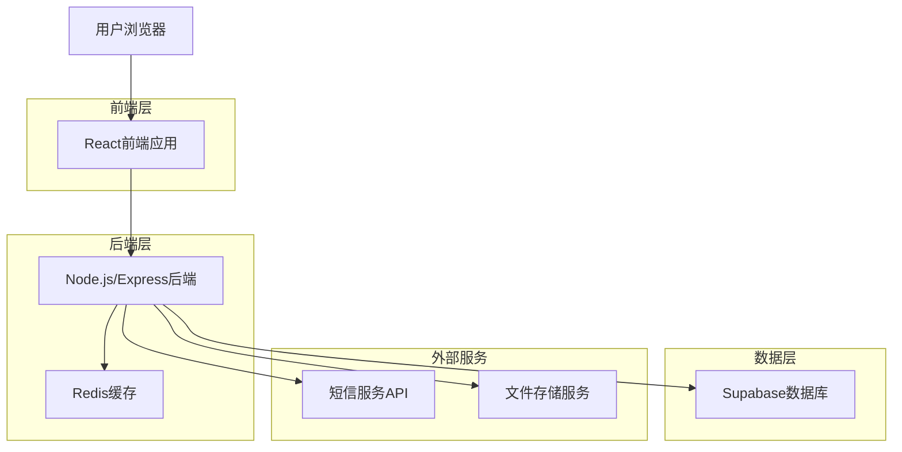
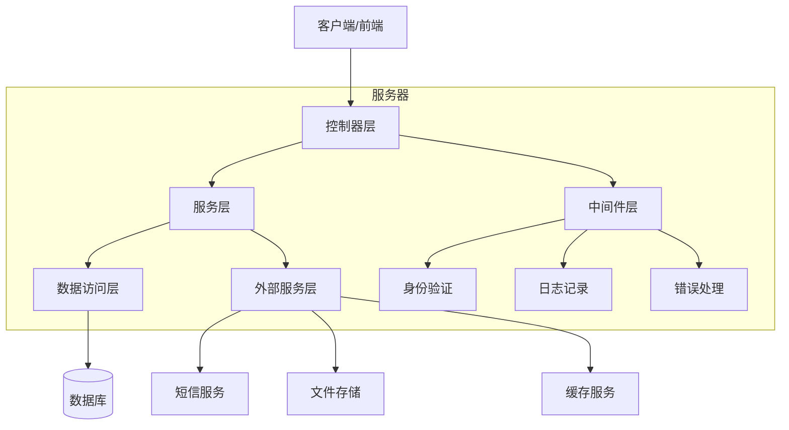
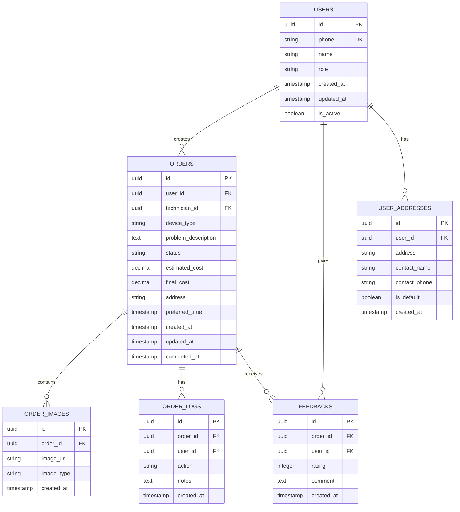

# XGX店内部维修下单管理系统 - 技术架构文档

## 1. 架构设计



## 2. 技术描述

- **前端**: React@18 + TypeScript + Ant Design + Tailwind CSS + Vite
- **后端**: Node.js@18 + Express@4 + TypeScript
- **数据库**: Supabase (PostgreSQL)
- **缓存**: Redis@7
- **文件存储**: Supabase Storage
- **短信服务**: 阿里云短信服务
- **部署**: Docker + Nginx

## 3. 路由定义

| 路由 | 用途 |
|------|------|
| / | 首页，根据用户角色重定向到对应工作台 |
| /login | 登录页面，支持手机验证码登录 |
| /user/dashboard | 用户工作台，显示订单概览和快速下单 |
| /user/order/create | 用户下单页面，创建维修订单 |
| /user/orders | 用户订单列表页面 |
| /user/order/:id | 用户订单详情页面 |
| /user/profile | 用户个人中心 |
| /technician/dashboard | 维修员工作台 |
| /technician/orders | 维修员订单列表 |
| /technician/order/:id | 维修员订单详情和处理页面 |
| /service/dashboard | 客服工作台 |
| /service/feedbacks | 客服反馈处理页面 |
| /admin/dashboard | 管理员数据大屏 |
| /admin/users | 管理员用户管理页面 |
| /admin/orders | 管理员订单管理页面 |
| /admin/settings | 管理员系统设置页面 |

## 4. API定义

### 4.1 核心API

**用户认证相关**
```
POST /api/auth/send-sms
```

请求参数:
| 参数名 | 参数类型 | 是否必需 | 描述 |
|--------|----------|----------|------|
| phone | string | true | 手机号码 |

响应:
| 参数名 | 参数类型 | 描述 |
|--------|----------|------|
| success | boolean | 发送状态 |
| message | string | 响应消息 |

```
POST /api/auth/login
```

请求参数:
| 参数名 | 参数类型 | 是否必需 | 描述 |
|--------|----------|----------|------|
| phone | string | true | 手机号码 |
| code | string | true | 验证码 |

响应:
| 参数名 | 参数类型 | 描述 |
|--------|----------|------|
| success | boolean | 登录状态 |
| token | string | JWT令牌 |
| user | object | 用户信息 |

**订单管理相关**
```
POST /api/orders
```

请求参数:
| 参数名 | 参数类型 | 是否必需 | 描述 |
|--------|----------|----------|------|
| device_type | string | true | 设备类型 |
| problem_description | string | true | 问题描述 |
| images | array | false | 问题图片 |
| preferred_time | string | false | 期望维修时间 |
| address | string | true | 维修地址 |

```
GET /api/orders
```

查询参数:
| 参数名 | 参数类型 | 是否必需 | 描述 |
|--------|----------|----------|------|
| status | string | false | 订单状态筛选 |
| page | number | false | 页码 |
| limit | number | false | 每页数量 |

```
PUT /api/orders/:id/status
```

请求参数:
| 参数名 | 参数类型 | 是否必需 | 描述 |
|--------|----------|----------|------|
| status | string | true | 新状态 |
| notes | string | false | 状态更新说明 |
| images | array | false | 相关图片 |

## 5. 服务器架构图



## 6. 数据模型

### 6.1 数据模型定义



### 6.2 数据定义语言

**用户表 (users)**
```sql
-- 创建用户表
CREATE TABLE users (
    id UUID PRIMARY KEY DEFAULT gen_random_uuid(),
    phone VARCHAR(20) UNIQUE NOT NULL,
    name VARCHAR(100) NOT NULL,
    role VARCHAR(20) DEFAULT 'user' CHECK (role IN ('user', 'technician', 'service', 'admin')),
    avatar_url TEXT,
    is_active BOOLEAN DEFAULT true,
    created_at TIMESTAMP WITH TIME ZONE DEFAULT NOW(),
    updated_at TIMESTAMP WITH TIME ZONE DEFAULT NOW()
);

-- 创建索引
CREATE INDEX idx_users_phone ON users(phone);
CREATE INDEX idx_users_role ON users(role);
```

**订单表 (orders)**
```sql
-- 创建订单表
CREATE TABLE orders (
    id UUID PRIMARY KEY DEFAULT gen_random_uuid(),
    user_id UUID NOT NULL,
    technician_id UUID,
    device_type VARCHAR(100) NOT NULL,
    problem_description TEXT NOT NULL,
    status VARCHAR(20) DEFAULT 'pending' CHECK (status IN ('pending', 'accepted', 'in_progress', 'completed', 'cancelled')),
    estimated_cost DECIMAL(10,2),
    final_cost DECIMAL(10,2),
    address TEXT NOT NULL,
    contact_name VARCHAR(100),
    contact_phone VARCHAR(20),
    preferred_time TIMESTAMP WITH TIME ZONE,
    created_at TIMESTAMP WITH TIME ZONE DEFAULT NOW(),
    updated_at TIMESTAMP WITH TIME ZONE DEFAULT NOW(),
    completed_at TIMESTAMP WITH TIME ZONE
);

-- 创建索引
CREATE INDEX idx_orders_user_id ON orders(user_id);
CREATE INDEX idx_orders_technician_id ON orders(technician_id);
CREATE INDEX idx_orders_status ON orders(status);
CREATE INDEX idx_orders_created_at ON orders(created_at DESC);
```

**订单图片表 (order_images)**
```sql
-- 创建订单图片表
CREATE TABLE order_images (
    id UUID PRIMARY KEY DEFAULT gen_random_uuid(),
    order_id UUID NOT NULL,
    image_url TEXT NOT NULL,
    image_type VARCHAR(20) DEFAULT 'problem' CHECK (image_type IN ('problem', 'repair', 'result')),
    created_at TIMESTAMP WITH TIME ZONE DEFAULT NOW()
);

-- 创建索引
CREATE INDEX idx_order_images_order_id ON order_images(order_id);
```

**订单日志表 (order_logs)**
```sql
-- 创建订单日志表
CREATE TABLE order_logs (
    id UUID PRIMARY KEY DEFAULT gen_random_uuid(),
    order_id UUID NOT NULL,
    user_id UUID NOT NULL,
    action VARCHAR(50) NOT NULL,
    notes TEXT,
    created_at TIMESTAMP WITH TIME ZONE DEFAULT NOW()
);

-- 创建索引
CREATE INDEX idx_order_logs_order_id ON order_logs(order_id);
CREATE INDEX idx_order_logs_created_at ON order_logs(created_at DESC);
```

**用户反馈表 (feedbacks)**
```sql
-- 创建用户反馈表
CREATE TABLE feedbacks (
    id UUID PRIMARY KEY DEFAULT gen_random_uuid(),
    order_id UUID NOT NULL,
    user_id UUID NOT NULL,
    rating INTEGER CHECK (rating >= 1 AND rating <= 5),
    comment TEXT,
    created_at TIMESTAMP WITH TIME ZONE DEFAULT NOW()
);

-- 创建索引
CREATE INDEX idx_feedbacks_order_id ON feedbacks(order_id);
CREATE INDEX idx_feedbacks_user_id ON feedbacks(user_id);
CREATE INDEX idx_feedbacks_rating ON feedbacks(rating);
```

**用户地址表 (user_addresses)**
```sql
-- 创建用户地址表
CREATE TABLE user_addresses (
    id UUID PRIMARY KEY DEFAULT gen_random_uuid(),
    user_id UUID NOT NULL,
    address TEXT NOT NULL,
    contact_name VARCHAR(100),
    contact_phone VARCHAR(20),
    is_default BOOLEAN DEFAULT false,
    created_at TIMESTAMP WITH TIME ZONE DEFAULT NOW()
);

-- 创建索引
CREATE INDEX idx_user_addresses_user_id ON user_addresses(user_id);
```

**初始化数据**
```sql
-- 插入管理员用户
INSERT INTO users (phone, name, role) VALUES 
('13800000000', '系统管理员', 'admin'),
('13800000001', '客服001', 'service'),
('13800000002', '维修员001', 'technician');

-- 插入测试订单数据
INSERT INTO orders (user_id, device_type, problem_description, address, contact_name, contact_phone)
SELECT 
    (SELECT id FROM users WHERE role = 'user' LIMIT 1),
    '手机',
    '屏幕破裂，需要更换屏幕',
    '北京市朝阳区xxx街道xxx号',
    '张三',
    '13900000000'
WHERE EXISTS (SELECT 1 FROM users WHERE role = 'user');
```